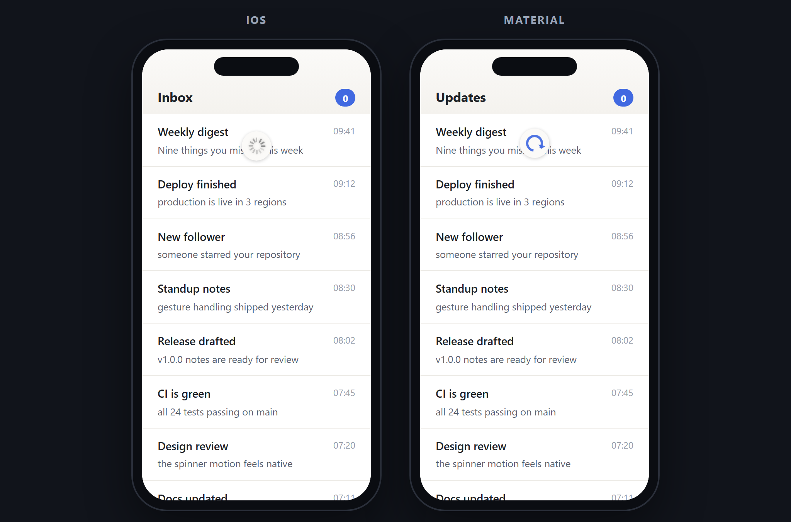
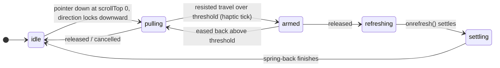

# pull-to-refresh-svelte

Native-feeling pull-to-refresh for Svelte 5 — pixel-faithful iOS and Material indicators, SSR-safe, touch **and** mouse.

[](https://github.com/jeeanribeiro/pull-to-refresh-svelte/actions/workflows/ci.yml)
[](LICENSE)

[](https://jeeanribeiro.github.io/pull-to-refresh-svelte/)

**[Live demo →](https://jeeanribeiro.github.io/pull-to-refresh-svelte/)** — pull the feeds with a finger or a mouse.

## Features

- **Pixel-faithful indicators** — the 12-bar iOS spinner with its staggered fade, and the Material arc that draws itself in as you pull, arrow scaling in near the threshold. Pure CSS, no icon fonts, no images.
- **Correct gesture handling** — unified Pointer Events (touch, mouse, pen), armed only when the nearest scroll container is at the top, with direction locking and log-based rubber-band resistance.
- **SSR-safe** — renders on the server without touching `window`; hydrates cleanly in SvelteKit.
- **Accessible** — `aria-busy`, a polite live region while refreshing, and `prefers-reduced-motion` support. Optional haptic tick when the pull arms.
- **Yours to style** — CSS custom properties for the built-ins, or replace the indicator entirely with a Svelte 5 snippet.
- **Zero dependencies** — Svelte 5 is the only peer.

## Install

```sh
npm install pull-to-refresh-svelte
```

> The first npm release is on its way. Until it lands you can install straight
> from GitHub — the package builds itself on install:
>
> ```sh
> npm install github:jeeanribeiro/pull-to-refresh-svelte
> ```

## Quickstart

```svelte
<script lang="ts">
	import { PullToRefresh } from 'pull-to-refresh-svelte';

	let items = $state<string[]>([]);

	async function reload() {
		items = await fetch('/api/feed').then((r) => r.json());
	}
</script>

<PullToRefresh onrefresh={reload}>
	<ul>
		{#each items as item}
			<li>{item}</li>
		{/each}
	</ul>
</PullToRefresh>
```

The indicator spins until the promise returned by `onrefresh` settles, then tucks itself away.

## API

### `<PullToRefresh>` props

| Prop              | Type                            | Default                | Description                                                                   |
| ----------------- | ------------------------------- | ---------------------- | ----------------------------------------------------------------------------- |
| `onrefresh`       | `() => Promise<void> \| void`   | — (required)           | Called when a pull is released past the threshold.                            |
| `platform`        | `'auto' \| 'ios' \| 'material'` | `'auto'`               | Indicator style. `auto` picks iOS on Apple touch devices, Material elsewhere. |
| `threshold`       | `number`                        | `80`                   | Resisted travel (px) required to arm a refresh.                               |
| `maxPull`         | `number`                        | half the viewport      | Raw finger travel (px) at which the rubber-band resistance saturates.         |
| `disabled`        | `boolean`                       | `false`                | Disables the gesture entirely.                                                |
| `vibrate`         | `boolean`                       | `true`                 | Short haptic tick (where supported) the moment the pull arms.                 |
| `refreshingLabel` | `string`                        | `'Refreshing content'` | Announced to screen readers while the refresh runs.                           |
| `indicator`       | `Snippet<[PullProgress]>`       | built-ins              | Custom indicator snippet; receives a live progress snapshot.                  |
| `class`           | `string`                        | `''`                   | Extra classes for the wrapper element.                                        |

### `PullProgress` (passed to custom indicators)

| Field        | Type                                                           | Meaning                                                |
| ------------ | -------------------------------------------------------------- | ------------------------------------------------------ |
| `progress`   | `number`                                                       | `0` at rest, `1` at the arm threshold, may exceed `1`. |
| `position`   | `number`                                                       | Resisted pull distance in px.                          |
| `phase`      | `'idle' \| 'pulling' \| 'armed' \| 'refreshing' \| 'settling'` | Gesture state machine phase.                           |
| `refreshing` | `boolean`                                                      | True while the `onrefresh` promise is pending.         |

### Theming the built-ins

```css
.my-feed {
	--ptr-indicator-bg: #1c1c1e; /* indicator disc background   */
	--ptr-indicator-size: 38px; /* disc diameter               */
	--ptr-ios-bar-color: #eee; /* iOS spinner bar color       */
	--ptr-material-color: #d33; /* Material arc + arrow color  */
	--ptr-z-index: 999; /* indicator stacking order    */
}
```

## Recipes

### Page-level refresh

Wrap the page content; the gesture arms whenever the document itself is scrolled to the top.

```svelte
<PullToRefresh onrefresh={reloadEverything}>
	<main>…the whole page…</main>
</PullToRefresh>
```

### List-level refresh

Put your own scroll container inside. The pull only arms when **that list** is at the top — a mid-scroll list swallows the drag, exactly like the native behavior.

```svelte
<PullToRefresh onrefresh={reloadInbox}>
	<ul style="height: 100%; overflow-y: auto; overscroll-behavior-y: contain;">
		{#each messages as message}
			<li>{message.subject}</li>
		{/each}
	</ul>
</PullToRefresh>
```

> **Tip:** set `overscroll-behavior-y: contain` on your scroll container (and/or
> `body`) so the browser's own pull-to-refresh and scroll chaining stay out of
> the way on mobile.

### Custom indicator

Any snippet becomes the indicator. `progress` is `1` exactly at the threshold.

```svelte
<PullToRefresh onrefresh={reload}>
	{#snippet indicator({ progress, refreshing })}
		<span class="rocket" style:rotate="{progress * 180}deg">
			{refreshing ? '🚀' : '⬇️'}
		</span>
	{/snippet}
	<section>…content…</section>
</PullToRefresh>
```

## How it works

Design notes, in the order the gesture sees them:



- **Scroll gating.** On `pointerdown` the component walks from the event target up to its wrapper looking for the nearest scrollable element (falling back to the document) and only tracks the gesture when it sits at `scrollTop === 0`.
- **Direction lock.** An 8px slop window decides the axis before anything moves; horizontal or upward intent hands the gesture straight back to the browser.
- **Rubber-band resistance.** Finger travel is damped through a logarithmic curve (`resistance.ts`) that approaches `maxPull / 2` asymptotically — the same easing as the original release of this component.
- **Passive by default.** All pointer listeners are passive. One `touchmove` interceptor, scoped to the component, prevents native scrolling only while a pull is actually in flight — which is also what keeps the browser from firing `pointercancel` mid-gesture.
- **Indicators are dumb.** They receive normalized `progress` and `refreshing` and derive everything else in CSS: the iOS bars reveal one by one; the Material arc scrubs a paused `clip-path` animation with a negative `animation-delay`.

## Development

```sh
pnpm install       # installs + builds the package once
pnpm dev           # demo site on :43130
pnpm test:unit     # Vitest (jsdom) — resistance, platform, gesture flow
pnpm test:e2e      # Playwright — mouse + real touch streams via CDP
pnpm lint          # prettier + eslint
pnpm check         # svelte-check
pnpm build         # demo build + svelte-package + publint
```

## Roadmap

- First npm release (`v1.0.0` is tagged; publish lands once npm trusted publishing is configured — see [RELEASING.md](RELEASING.md))
- Nested-scroll edge cases (horizontal carousels inside vertical feeds)
- An opt-in "push content down" layout mode alongside the floating indicator

## Contributing

Issues and PRs are welcome — see [CONTRIBUTING.md](CONTRIBUTING.md).

## License

[MIT](LICENSE) © Jean Ribeiro
